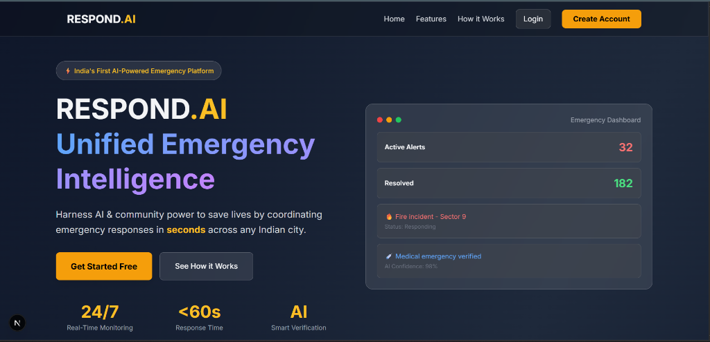
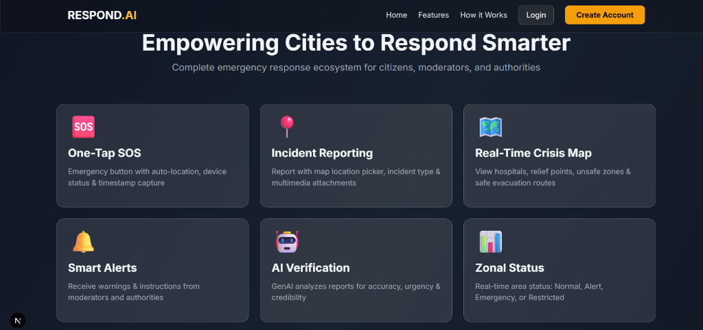
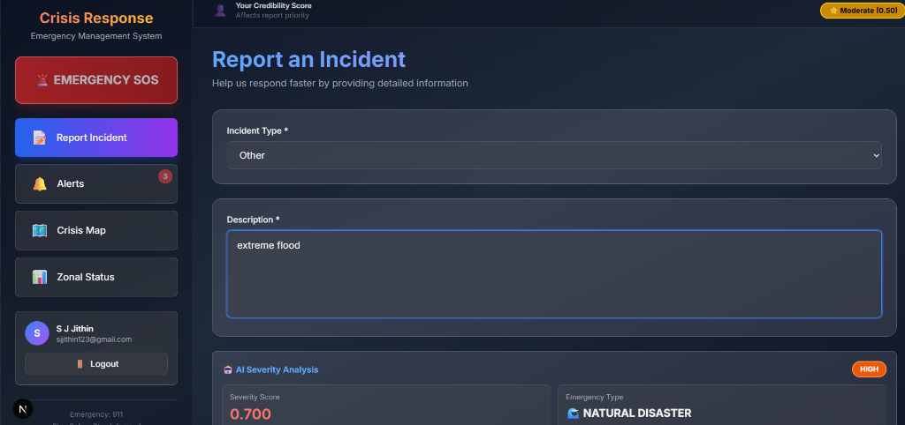
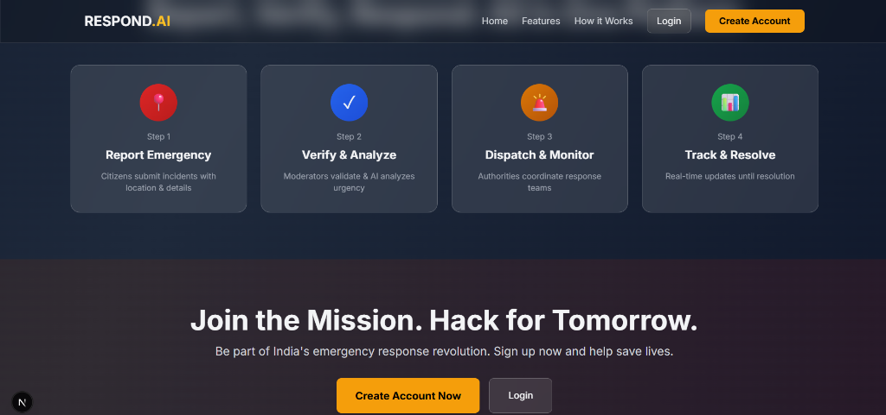

# RESPOND.AI

**Empowering Cities to Respond Smarter.**  
A unified emergency intelligence platform that harnesses AI and community power to save lives by coordinating emergency responses in seconds.



## 🚀 Overview

Respond.AI is a complete emergency response ecosystem designed for citizens, moderators, and authorities. It bridges the gap between incident reporting and emergency dispatch using real-time data, AI-powered verification (Trust-Weighted Severity Model), and live crisis mapping.

## ✨ Key Features

-   **One-Tap SOS**: Instant emergency button with auto-location and device status capture.
-   **AI Verification**: Generative AI analyzes reports for accuracy, urgency, and credibility scores.
-   **Real-Time Crisis Map**: Live visualization of incidents, hospitals, relief points, and safe zones.
-   **Smart Alerts**: Push notifications and warnings from authorities.
-   **Trust-Weighted Severity Model (TWSM)**: Intelligent backend algorithm that prioritizes incidents based on reporter credibility and content analysis.



## 🛠️ Tech Stack

### Frontend
-   **Framework**: [Next.js](https://nextjs.org/) (React)
-   **Styling**: [Tailwind CSS](https://tailwindcss.com/)
-   **Maps**: [Leaflet](https://leafletjs.com/) / React Leaflet
-   **State/Data**: Firebase (Firestore, Auth)

### Backend
-   **Framework**: [Flask](https://flask.palletsprojects.com/) (Python)
-   **Database**: SQLite (Development) / Firestore Sync
-   **AI**: Google Gemini Pro (via GenerativeAI SDK)
-   **Algorithm**: Trust-Weighted Severity Model (TWSM)

## 📸 Screenshots

### Incident Reporting
Citizens can report incidents with detailed descriptions and multimedia. The AI automatically analyzes the content.



### Emergency Workflow
A streamlined process from reporting -> verification -> dispatch -> resolution.



## 🚦 Getting Started

### Prerequisites
-   Node.js (v18+)
-   Python (v3.9+)
-   Firebase Project Credentials

### 1. Frontend Setup
```bash
# Install dependencies
npm install

# Run development server
npm run dev
```
Open [http://localhost:3000](http://localhost:3000) to view the app.

### 2. Backend Setup
Navigate to the `backend` directory:
```bash
cd backend

# Create virtual environment
python -m venv venv
# Windows:
venv\Scripts\activate
# Mac/Linux:
source venv/bin/activate

# Install dependencies
pip install -r requirements.txt

# Run Flask server
python app.py
```
The backend runs on [http://localhost:5000](http://localhost:5000).

## 📚 Documentation
-   [Firebase Setup Guide](backend/FIREBASE_SETUP.md)
-   [Testing Guide](backend/TESTING_GUIDE.md)

## 📄 License
MIT License.
